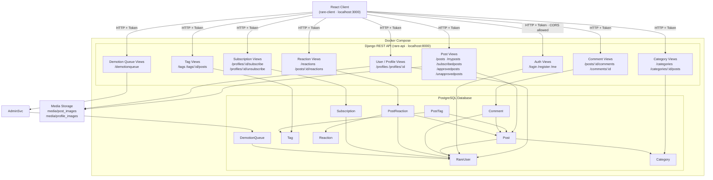
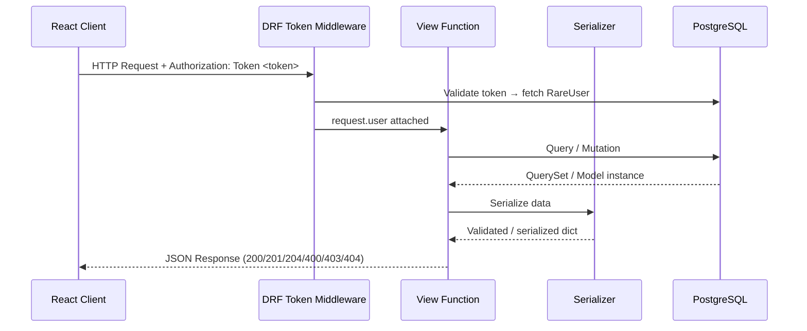
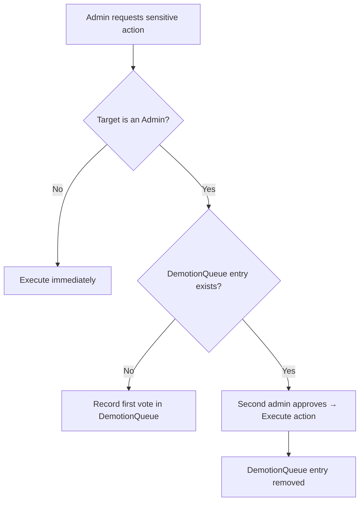

# Rare API — Architecture Overview

## Tech Stack

| Layer | Technology |
|---|---|
| Frontend | React (component-based, feature-organized) |
| Backend | Django 4.2 + Django REST Framework |
| Auth | DRF Token Authentication |
| Database | PostgreSQL |
| Media Storage | Local filesystem (`media/`) |
| Infrastructure | Docker Compose |

---

## High-Level Architecture

---

## Request / Response Flow

---

## Feature Modules

| Module | Endpoints | Key Behavior |
|---|---|---|
| Auth | `/login`, `/register`, `/me` | Issues DRF tokens; `me` returns the authenticated user's profile |
| Posts | `/posts`, `/myposts`, `/subscribedposts`, `/approvedposts`, `/unapprovedposts` | Admin posts auto-approve; regular posts enter moderation queue |
| Comments | `/posts/:id/comments`, `/comments/:id` | Full CRUD; only author can edit/delete |
| Profiles | `/profiles`, `/profiles/:id` | Admin-only list; two-vote system for demotion/deactivation |
| Subscriptions | `/profiles/:id/subscribe`, `/profiles/:id/unsubscribe` | Soft-delete model via `ended_on` field |
| Reactions | `/reactions`, `/posts/:id/reactions` | Returns per-reaction counts and `user_reacted` flag |
| Categories | `/categories`, `/categories/:id/posts` | Admin CRUD; any user can filter posts by category |
| Tags | `/tags`, `/tags/:id/posts` | Admin CRUD; authors can tag their own posts |

---

## Admin Two-Vote System

Sensitive admin actions (demoting an admin, deactivating an admin account) require approval from two separate administrators before execution. The `DemotionQueue` table tracks pending votes. Promotions and non-admin account changes execute immediately.

