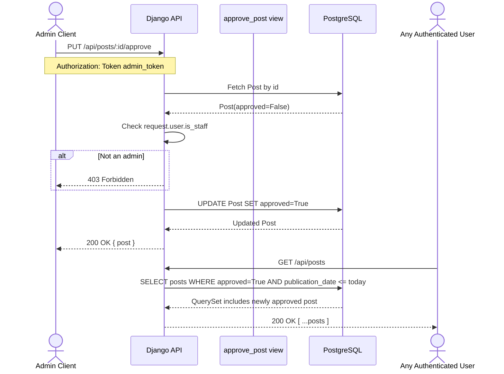

# Create Post — Sequence Diagram

Traces the full lifecycle of a user creating a new post: from button click in the React client through to the database write.

```mermaid
sequenceDiagram
    actor User
    participant PostCreate as PostCreate (React)
    participant CatMgr as CategoryManager
    participant PostMgr as PostManager
    participant ApiJs as api.js
    participant Django as Django API
    participant TokenAuth as TokenAuthentication
    participant View as post_list view
    participant Ser as PostDetailSerializer
    participant DB as PostgreSQL

    rect rgb(230, 245, 255)
        Note over PostCreate: Component mounts — load categories for dropdown
        PostCreate->>CatMgr: useEffect → getCategories()
        CatMgr->>ApiJs: authHeader()
        ApiJs-->>CatMgr: Authorization: Token ..., Accept: application/json
        CatMgr->>Django: GET /api/categories
        Django->>DB: SELECT * FROM category
        DB-->>Django: [{ id, label }, ...]
        Django-->>CatMgr: 200 OK [categories]
        CatMgr-->>PostCreate: setCategories([...])
        Note over PostCreate: Dropdown populated; user can now select a category
    end

    User->>PostCreate: fills title, category, content (optional image) and clicks "Save"

    rect rgb(255, 245, 230)
        Note over PostCreate: handleSave() — HTTP Request 1: create the post
        PostCreate->>PostMgr: createPost({ title, category_id, content })
        PostMgr->>ApiJs: authHeader()
        ApiJs-->>PostMgr: Authorization: Token ..., Accept: application/json
        Note over PostMgr,ApiJs: PostManager spreads authHeader() + adds Content-Type: application/json
        PostMgr->>Django: POST /api/posts — Authorization: Token value — Content-Type: application/json — body: { title, category_id, content }

        Django->>TokenAuth: validate token
        TokenAuth->>DB: SELECT RareUser WHERE token = value
        DB-->>TokenAuth: RareUser instance

        alt Token invalid or missing
            TokenAuth-->>Django: 401 Unauthorized
            Django-->>PostMgr: 401
        end

        TokenAuth-->>View: request.user = authenticated RareUser

        View->>DB: SELECT category WHERE pk = category_id

        alt category_id not found
            DB-->>View: DoesNotExist
            View-->>Django: 400 Bad Request
        end

        DB-->>View: Category instance

        Note over View: approved = request.user.is_staff

        alt is_staff = True (Admin — auto-publish)
            View->>DB: INSERT Post(user, category, title, content, publication_date=today, approved=True)
            DB-->>View: Post(id=N, approved=True)
            View->>Ser: PostDetailSerializer(post)
            Ser-->>View: JSON { id, title, content, approved: true, ... }
            Django-->>PostMgr: 201 Created { post — approved: true, live immediately }
        else is_staff = False (Regular Author — enters moderation queue)
            View->>DB: INSERT Post(user, category, title, content, publication_date=today, approved=False)
            DB-->>View: Post(id=N, approved=False)
            View->>Ser: PostDetailSerializer(post)
            Ser-->>View: JSON { id, title, content, approved: false, ... }
            Django-->>PostMgr: 201 Created { post — approved: false, pending moderation }
        end

        PostMgr-->>PostCreate: post { id, title, approved, ... }
    end

    alt User attached an image (fileRef.current.files[0] exists)
        rect rgb(230, 255, 230)
            Note over PostCreate: handleSave() — HTTP Request 2: upload header image
            PostCreate->>PostMgr: uploadPostImage(post.id, formData)
            PostMgr->>ApiJs: authHeader()
            ApiJs-->>PostMgr: Authorization: Token ..., Accept: application/json
            Note over PostMgr: No Content-Type set manually — browser auto-sets multipart/form-data with boundary
            PostMgr->>Django: PUT /api/posts/{id}/image — Authorization: Token value — multipart/form-data; image=file
            Django->>DB: UPDATE post SET image_url = /media/post_images/... WHERE id = post_id
            DB-->>Django: updated Post
            Django-->>PostMgr: 200 OK { image_url }
            PostMgr-->>PostCreate: { image_url }
            PostCreate->>User: navigate("/posts/{id}")
        end
    else No image selected — only one HTTP request was made
        PostCreate->>User: navigate("/posts/{id}")
    end
```

---

## Post Approval Flow (Admin Moderation)

After a regular author's post is created with `approved=False`, an admin must review and approve it before it appears in the public feed.



---

## Key Business Rules

| Rule | Detail |
|---|---|
| Categories on mount | `PostCreate` calls `getCategories()` in a `useEffect([])` so the dropdown is populated before the user can submit. |
| Auth token source | `api.js` owns `authHeader()`. Neither the component nor the manager constructs or reads `localStorage` directly — they call `authHeader()` and spread the result into `headers`. |
| Two requests when image attached | `POST /api/posts` creates the post record; only if a file was selected does a second `PUT /api/posts/{id}/image` upload the image. The post ID from the first response is required by the second. |
| Admin auto-publish | If `request.user.is_staff` is `True`, the view saves the post with `approved=True` and it appears immediately in the public feed. |
| Author moderation queue | If `request.user.is_staff` is `False`, the post is saved with `approved=False` and is only visible in the author's `/myposts` and the admin's `/unapprovedposts` endpoints until approved. |
| Publication date filter | The public `/posts` endpoint only returns posts where `publication_date <= today`, regardless of approval status. |
| Approve / Unapprove | Only admins can call `/posts/:id/approve` or `/posts/:id/unapprove`. |
| Edit ownership | Only the post's original author can `PUT /posts/:id`. |
| Delete permission | The post's author **or** any admin can `DELETE /posts/:id`. |
