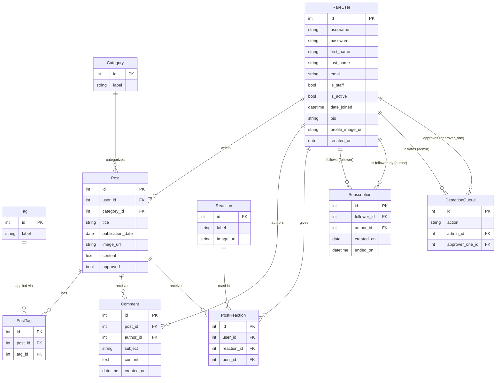

# Rare API — Database Schema

## Entity Relationship Diagram

---

## Model Reference

### RareUser
Extends Django's `AbstractUser`.

| Field | Type | Notes |
|---|---|---|
| id | AutoField | PK |
| username | CharField | Unique |
| password | CharField | Hashed |
| first_name | CharField | |
| last_name | CharField | |
| email | EmailField | |
| is_staff | BooleanField | `True` = Admin role |
| is_active | BooleanField | `False` = deactivated account |
| date_joined | DateTimeField | Auto-set |
| bio | CharField(500) | |
| profile_image_url | CharField(500) | Path in `media/profile_images/` |
| created_on | DateField | Auto-set on creation |

---

### Post

| Field | Type | Notes |
|---|---|---|
| id | AutoField | PK |
| user | FK → RareUser | `CASCADE`, `related_name='posts'` |
| category | FK → Category | `CASCADE`, `related_name='posts'` |
| title | CharField(300) | |
| publication_date | DateField | |
| image_url | CharField(500) | Optional; path in `media/post_images/` |
| content | TextField | |
| approved | BooleanField | Default `False`; admins auto-publish |

---

### Category

| Field | Type | Notes |
|---|---|---|
| id | AutoField | PK |
| label | CharField(200) | |

---

### Tag

| Field | Type | Notes |
|---|---|---|
| id | AutoField | PK |
| label | CharField(200) | |

---

### PostTag (junction)

| Field | Type | Notes |
|---|---|---|
| id | AutoField | PK |
| post | FK → Post | `CASCADE`, `related_name='post_tags'` |
| tag | FK → Tag | `CASCADE`, `related_name='post_tags'` |

---

### Comment

| Field | Type | Notes |
|---|---|---|
| id | AutoField | PK |
| post | FK → Post | `CASCADE`, `related_name='comments'` |
| author | FK → RareUser | `CASCADE`, `related_name='comments'` |
| subject | CharField(300) | Default `''` |
| content | TextField | |
| created_on | DateTimeField | Auto-set on creation |

---

### Reaction

| Field | Type | Notes |
|---|---|---|
| id | AutoField | PK |
| label | CharField(200) | |
| image_url | CharField(500) | Emoji / icon URL |

---

### PostReaction (junction)

| Field | Type | Notes |
|---|---|---|
| id | AutoField | PK |
| user | FK → RareUser | `CASCADE`, `related_name='post_reactions'` |
| reaction | FK → Reaction | `CASCADE`, `related_name='post_reactions'` |
| post | FK → Post | `CASCADE`, `related_name='post_reactions'` |

---

### Subscription

| Field | Type | Notes |
|---|---|---|
| id | AutoField | PK |
| follower | FK → RareUser | `CASCADE`, `related_name='subscriptions'` |
| author | FK → RareUser | `CASCADE`, `related_name='subscribers'` |
| created_on | DateField | Auto-set on creation |
| ended_on | DateTimeField | `NULL` = active; set on unsubscribe (soft delete) |

---

### DemotionQueue

| Field | Type | Notes |
|---|---|---|
| id | AutoField | PK |
| action | CharField(200) | Format: `"action_type:target_user_id"` |
| admin | FK → RareUser | First admin who initiated the action |
| approver_one | FK → RareUser | Second admin who approved |
| (unique_together) | | `(action, admin, approver_one)` |
